# Sabiá — Features & Current UX

A feature-by-feature record of what Sabiá actually does today and what each
screen currently looks like, captured live from a running build (not
inferred from code alone). Written to make it easy to spot what's worth
improving — see **Observed issues** at the end for the running list this
pass turned up.

Screenshots in `docs/screenshots/`. All captured 2026-07-17 against a fresh
profile (0 streak, 0 XP) — a returning user's screens will show real
numbers/progress in the same layouts.

---

## 1. Dashboard / Map (`/`)

**What it does:** The home screen. Shows your streak and CEFR level, the
RPG-style journey map of 8 Minas Gerais cities (Belo Horizonte, Ouro Preto,
Mariana, Tiradentes, Diamantina, Serra da Canastra, Juiz de Fora, Uberaba,
Congonhas), and the single "Start" action for today's lesson.

**Current UX:**
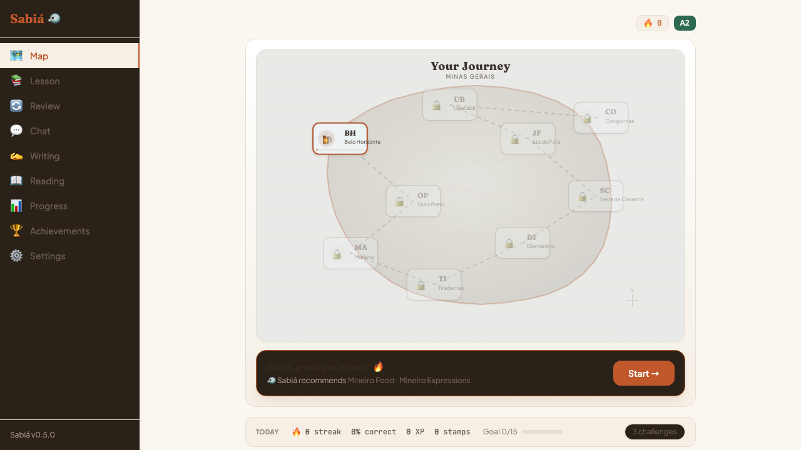

Redesigned 2026-07-17 (was previously a stack of greeting/seasonal banner/5
stat tiles/CEFR bar/daily goal/quick-actions row/challenge cards — all
before any interaction). Now: a slim header (streak + level chips only),
one hero card fusing the map with a docked "Start" panel showing a live
AI-generated coaching note and "Sabiá recommends" topic links, and a single
quiet "Today" strip below holding stats, daily goal, and pills for
reviews/listening/challenges — collapsed, not competing with the hero.

Clicking an unlocked city opens a detail panel:

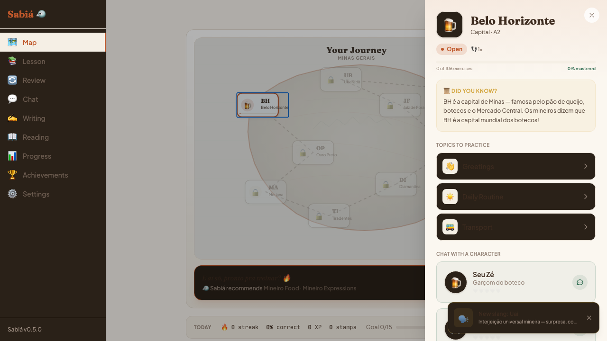

Shows a cultural fact, topics to practice (linking into `/lesson`), NPCs to
chat with (hearts 0-5 relationship system), and exercise/mastery counts for
that city. Locked cities show a lock icon and can't be clicked yet.

## 2. Session — the daily Lesson Arc (`/session`)

**What it does:** The actual "Start" destination from the dashboard. Plays
a themed lesson: SRS reviews first (if any are due), then a **Learn**
phase (vocab/pattern teach cards) → **Practice** phase (recognize +
produce exercises, mixed types, escalating difficulty).

**Current UX:**
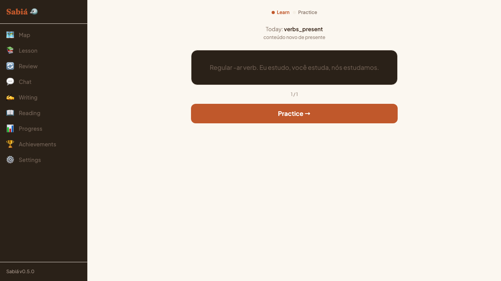
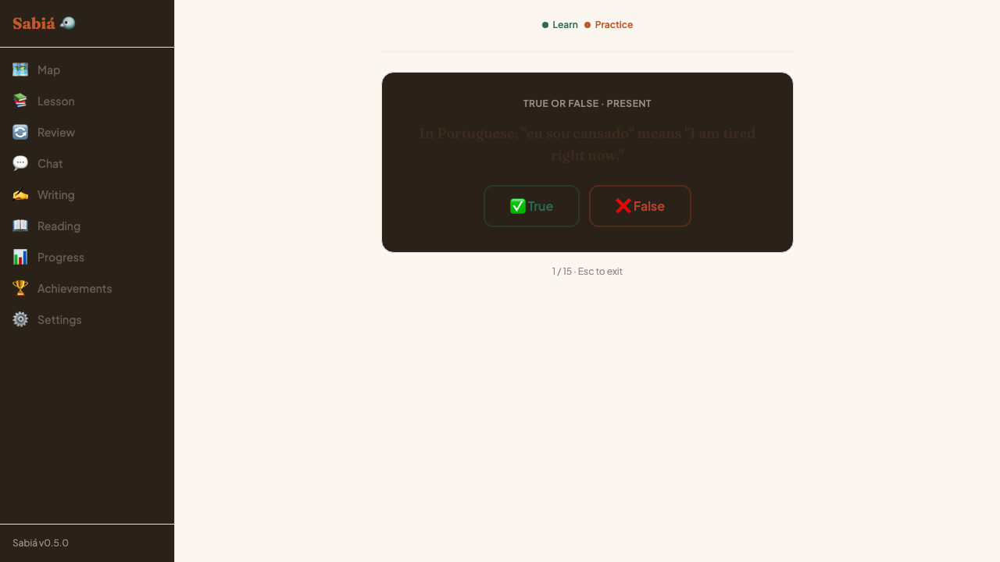

Two-stage progress indicator (Learn/Practice) at top. Theme and reason
("conteúdo novo de presente" — new content on this topic) shown above the
teach card. Practice mixes true/false, multiple choice, cloze, reorder, and
error-correction items in one escalating-difficulty sequence. Ends on a
"Lesson complete!" screen with XP/streak/correct-count — no forced chat
step (removed 2026-07-16; previously the only way to finish was through an
undirected AI conversation).

## 3. Lesson — legacy practice list (`/lesson`)

**What it does:** A simpler, older practice mode: pick a raw exercise type
(defaults to `vocab`) and optionally a topic, get a flat unthemed list to
work through. Reachable directly, or via topic links from the city panel
and "Sabiá recommends."

**Current UX:**
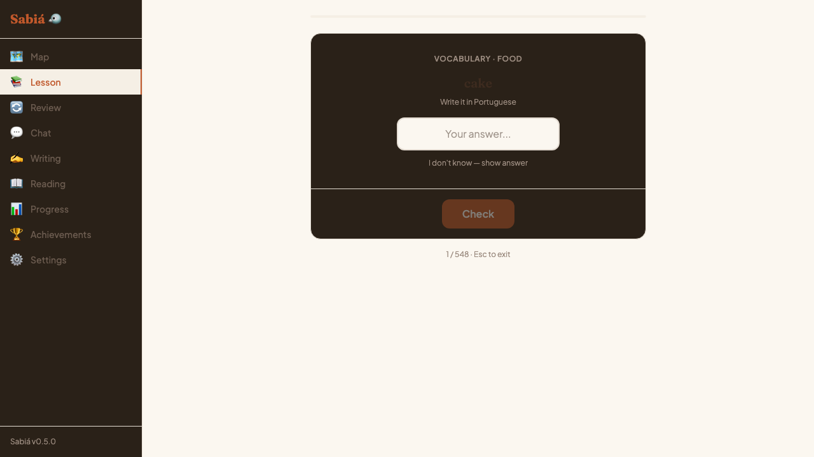

No stage progress, no theme framing — just "N / total" and the exercise
card. Functionally overlaps with `/session`'s Practice phase but with none
of the Teach setup, theming, or adaptive rotation logic.

## 4. Review (`/review`)

**What it does:** Pure SRS — exercises whose spaced-repetition interval has
come due. Empty state when nothing's due.

**Current UX:**
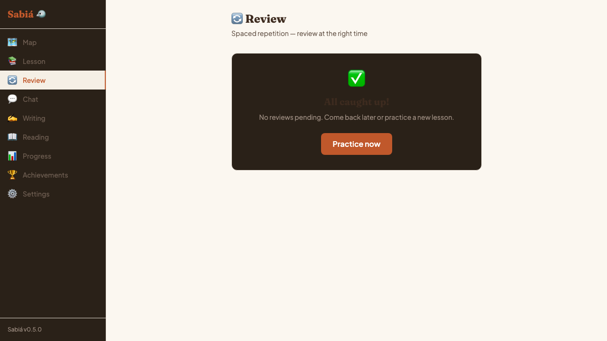

Clean empty state with a "Practice now" fallback CTA. When reviews exist,
presumably renders through the same `ExercisePlayer` used everywhere else
(not captured here — no reviews were due in this test profile).

## 5. Chat / Conversation (`/conversation`)

**What it does:** Free-form AI conversation practice in Mineiro Portuguese
with Claude. Also the destination `/session`'s old capstone used to route
into (now decoupled — reachable independently from the nav any time).

**Current UX:**
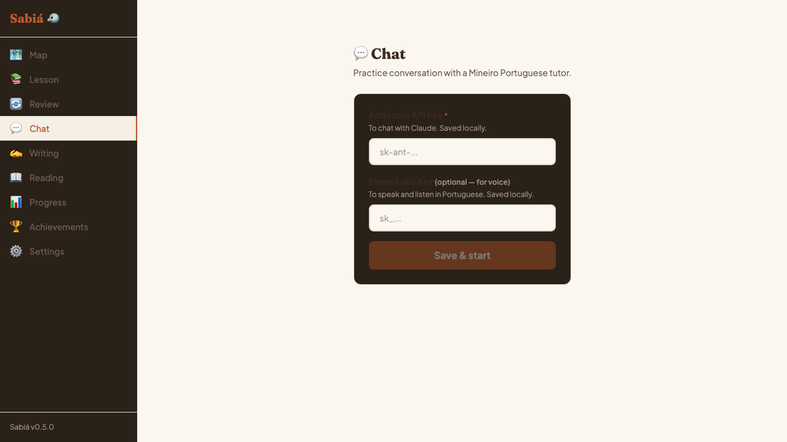

Gated behind an API key setup form (Anthropic key required, ElevenLabs
optional for voice) when no key is configured. No preview of what the
conversation experience looks like once keys are set — this is the same
gate `/writing` uses.

## 6. Writing (`/writing`)

**What it does:** Free-form Portuguese writing practice with AI feedback
and corrections from Claude.

**Current UX:**
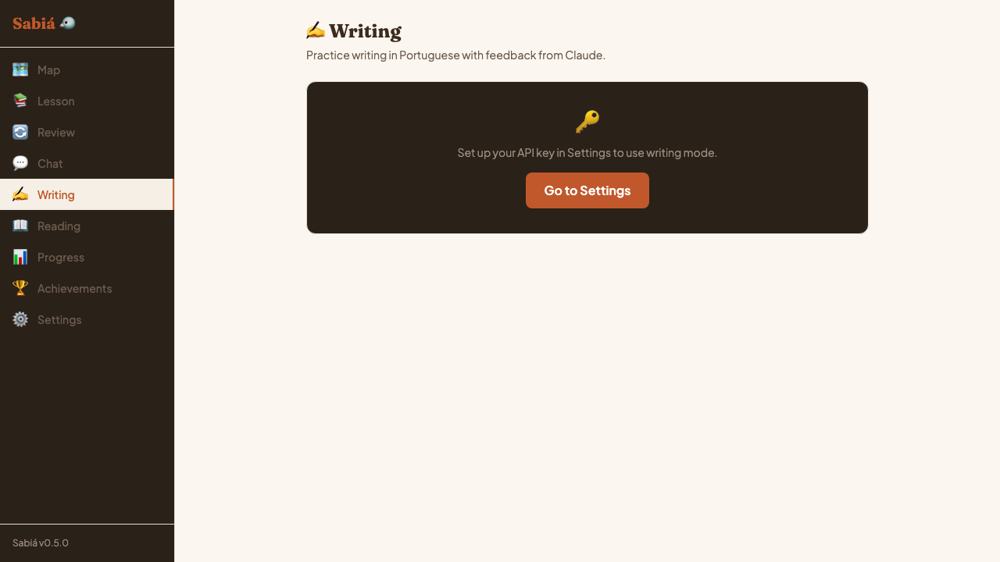

Same API-key gate pattern as Chat, with a "Go to Settings" shortcut instead
of an inline key field.

## 7. Reading (`/reading`)

**What it does:** Short Portuguese reading passages with comprehension
questions. Fully offline — no AI dependency.

**Current UX:**
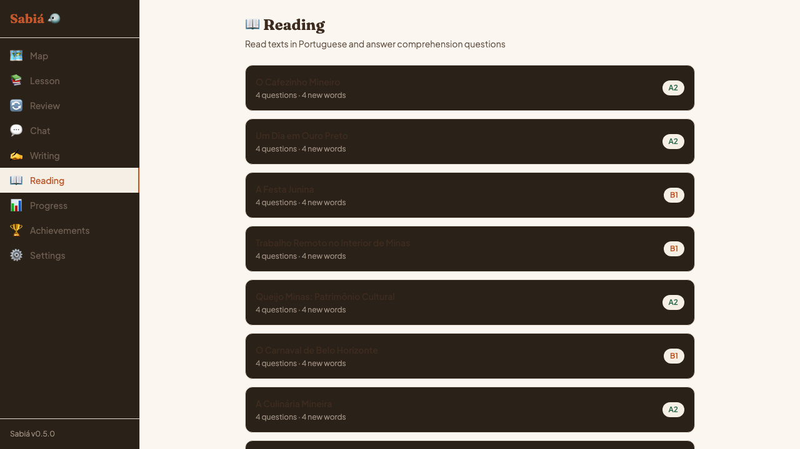

A flat list of passages (title, CEFR badge, question count, new-word
count) — e.g. "O Cafezinho Mineiro," "A Festa Junina," "O Carnaval de Belo
Horizonte." No filtering or sorting visible; presumably opens into a
reading+quiz view on click (not captured).

## 8. Progress (`/progress`)

**What it does:** Stats dashboard — total XP, streak, accuracy, answer
count, and a 90-day GitHub-style practice calendar heatmap.

**Current UX:**
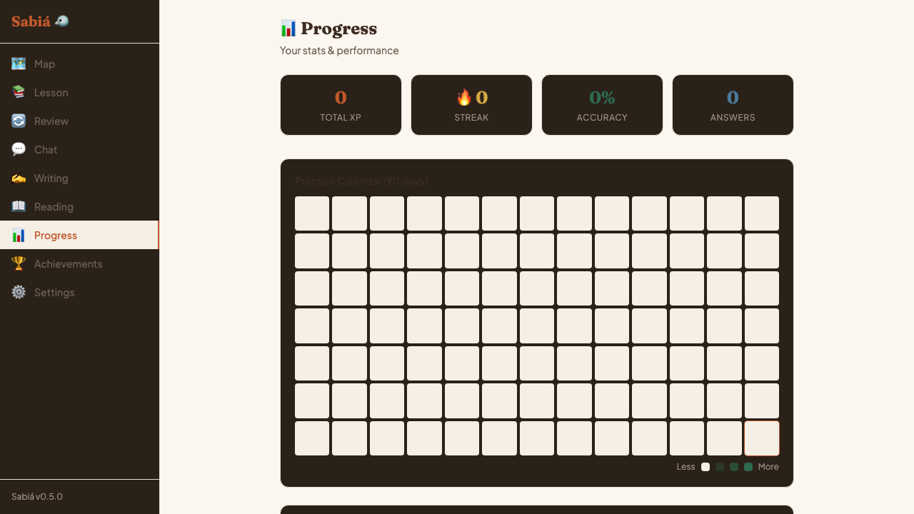

Duplicates some of what the dashboard's "Today" strip already shows
(streak, accuracy/XP), but adds the heatmap and presumably longer-range
stats below the fold (not captured — page continues past the calendar).

## 9. Achievements (`/achievements`)

**What it does:** 16 badges across categories (Streak, Exercises, and
presumably more below the fold — Mastery, Social/NPC, Seasonal per
`achievements.ts`), each bronze/silver/gold tiered.

**Current UX:**
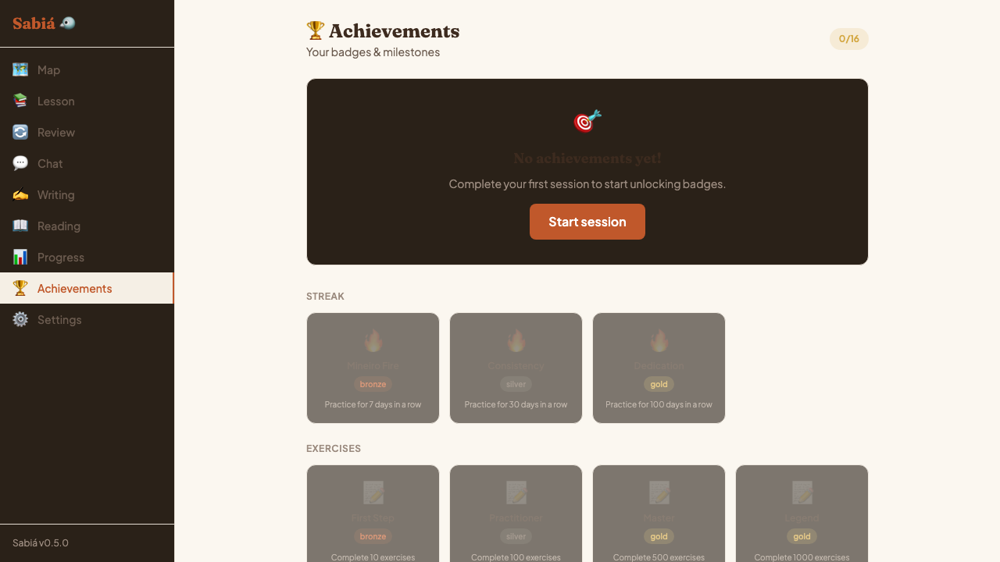

Empty-state hero ("No achievements yet!") plus a badge grid, locked badges
shown grayed-out with their unlock condition ("Practice for 7 days in a
row," "Complete 500 exercises"). "0/16" counter top-right.

## 10. Settings (`/settings`)

**What it does:** CEFR level override, daily goal (5/10/15/20/30
exercises), dialect selector (Mineiro), theme (Light/Dark/System), and API
key management (Anthropic + ElevenLabs).

**Current UX:**
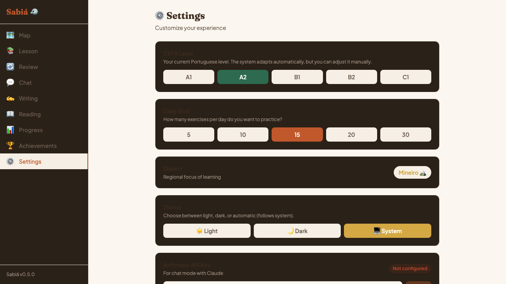

Card-per-setting layout, current selection highlighted (A2, 15/day, System
theme shown selected here). Everything needed to unlock AI features (Chat,
Writing, NPC conversations, coaching notes) lives here.

## Also present (not separately screenshotted)

- **NPC chat** — overlay triggered from a city panel's NPC list, Claude
  Haiku-powered conversations per character, with a 5-heart relationship
  meter that presumably unlocks content/dialogue over time (`npc.ts`).
- **Weekly challenges** — 4 types (`exercise_count`, `session_count`,
  `accuracy_topic`, `seasonal`), surfaced as a count pill on the dashboard.
- **Seasonal events** — 6 defined, tied to the real calendar (the "Arraiá!
  Festas juninas" banner seen in earlier dashboard versions was one of
  these; it's been removed from the dashboard itself but the underlying
  system still exists for weekly challenges).
- **Travel journal** — stamps, slang collection, NPC gifts (`journal.ts`),
  surfaced as the "stamps" stat and toast notifications (e.g. "New slang:
  Uai!") triggered by city visits.

---

## Content snapshot (as of this pass)

**1,312 exercises** (up from 1,063 — +249 added 2026-07-17 to close
content gaps):

| Level | Exercises |
|-------|-----------|
| A2 | 817 |
| B1 | 282 |
| B2 | 93 |
| C1 | 120 |

By type: 548 vocab, 337 cloze, 136 true/false, 134 multiple choice, 85
reorder, 72 error correction.

---

## Observed issues (worth acting on)

1. **Dark-mode regression on the new dashboard hero.** The redesigned
   hero card uses a hard-coded gradient (`from-white to-pedra-subtle`)
   instead of the semantic `bg-white`/token classes the rest of the app
   uses. Under System theme with OS dark mode on, the sidebar, Start card,
   and Today strip correctly go dark, but the hero/map wrapper doesn't —
   producing a half-light-half-dark dashboard. Confirmed the rest of the
   app (e.g. the `/lesson` exercise card) handles this correctly, so it's
   isolated to the new dashboard hero, not systemic. Quick fix: swap the
   gradient for theme-aware tokens.
2. **`/lesson` and `/session`'s Practice phase are two different paths to
   the same thing** — flat exercise practice — with no shared theming,
   progress framing, or adaptive rotation on the `/lesson` side. Worth
   deciding whether `/lesson` should be folded into `/session`, kept as a
   deliberate "quick practice, no theme" mode, or removed now that the
   Lesson Arc covers the themed case well.
3. **Chat and Writing gate identically on API keys** with no preview of
   what's on the other side — a new user hits two dead ends before ever
   seeing what NPC conversation or writing feedback looks like. A static
   preview or example transcript might reduce the "why would I set this
   up" drop-off.
4. **Progress page overlaps with the dashboard's Today strip** (streak,
   accuracy, XP all shown in both places). Not broken, but worth deciding
   if `/progress` should show *only* what's not already visible on
   dashboard (the calendar heatmap, longer-range trends) rather than
   repeating the top-line numbers.
5. **Seasonal banner removed from the dashboard but the system is still
   live** (6 seasons, feeding weekly challenges) — worth confirming
   seasonal awareness still surfaces somewhere now that its one visible
   UI hook is gone.
6. **Topic/type miscategorization** (tracked in `TODOS.md`): some
   exercises have `topic` set to their own exercise type (e.g.
   `topic: 'true_false'`) instead of their real subject, hiding them from
   that subject's pool in `/session`'s theme selection. Not a UX issue
   directly, but it undercounts real content in the areas above.
